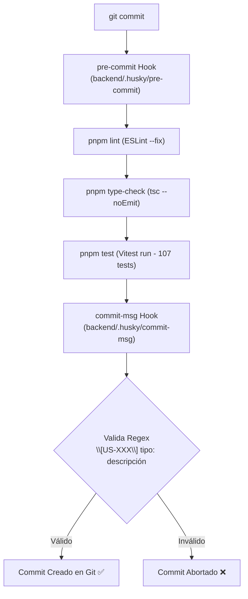
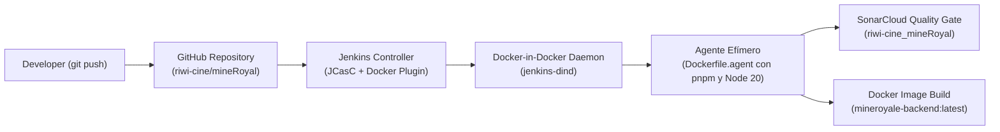

# 🎬 mineRoyal Backend API

> API REST empresarial para la plataforma de reserva y compra de boletos de cine **mineRoyal**, desarrollada con **NestJS**, **TypeScript**, **PostgreSQL**, **Redis**, pruebas automatizadas con **Vitest**, aseguramiento estático de calidad con **SonarCloud** y pipeline de integración continua orquestado en **Jenkins**.

---

## 📑 Tabla de Contenidos

- [🏛️ Arquitectura del Sistema](#️-arquitectura-del-sistema)
- [🛠️ Stack Tecnológico](#️-stack-tecnológico)
- [🌿 Flujo de Trabajo Git y Gobernanza de Commits](#-flujo-de-trabajo-git-y-gobernanza-de-commits)
  - [Estrategia de Ramas](#estrategia-de-ramas)
  - [Convención de Commits](#convención-de-commits)
  - [Git Hooks Locales con Husky](#git-hooks-locales-con-husky)
- [🚀 Puesta en Marcha en Entorno Local](#-puesta-en-marcha-en-entorno-local)
  - [Requisitos Previos](#requisitos-previos)
  - [1. Instalación de Dependencias](#1-instalación-de-dependencias)
  - [2. Variables de Entorno](#2-variables-de-entorno)
  - [3. Infraestructura con Docker Compose](#3-infraestructura-con-docker-compose)
  - [4. Migraciones y Datos Semilla (Seeders)](#4-migraciones-y-datos-semilla-seeders)
  - [5. Ejecución del Servidor](#5-ejecución-del-servidor)
- [🧪 Pruebas Automatizadas y Cobertura](#-pruebas-automatizadas-y-cobertura)
- [🔄 Pipeline CI/CD (Jenkins & SonarCloud)](#-pipeline-cicd-jenkins--sonarcloud)
  - [Arquitectura de Construcción](#arquitectura-de-construcción)
  - [Etapas del Pipeline Declarativo](#etapas-del-pipeline-declarativo)
  - [Gobernanza de Calidad en SonarCloud](#gobernanza-de-calidad-en-sonarcloud)
  - [Estrategia "Build Once" con Docker](#estrategia-build-once-con-docker)
- [📚 Documentación Adicional](#-documentación-adicional)

---

## 🏛️ Arquitectura del Sistema

La API sigue los principios de **Domain-Driven Design (DDD)** y **Clean Architecture**, dividida en módulos cohesivos y desacoplados:
- **Auth & Users:** Autenticación JWT con Refresh Tokens, RBAC y hashing criptográfico con `bcrypt`.
- **Movies & Functions:** Cartelera, detalle de películas y programación de funciones de cine.
- **Seats:** Selección, asignación y validación de asientos en tiempo real.
- **Cart & Tariffs:** Carrito transaccional respaldado por Redis y cálculo determinista de tarifas/descuentos.
- **Shared / Infrastructure:** Repositorio base, transformadores numéricos, criptografía simétrica (AES-256-GCM) y clientes de base de datos.

---

## 🛠️ Stack Tecnológico

| Capa / Herramienta | Tecnología | Propósito |
| :--- | :--- | :--- |
| **Framework** | [NestJS 10](https://nestjs.com/) | Arquitectura modular basada en TypeScript |
| **Runtime & Gestor** | Node.js 20 LTS + [pnpm](https://pnpm.io/) | Ejecución eficiente y gestión estricta de dependencias con lockfile |
| **Base de Datos Principal**| [PostgreSQL 16](https://www.postgresql.org/) + [TypeORM](https://typeorm.io/) | Persistencia relacional, migraciones versionadas y transacciones |
| **Caché y Sesiones** | [Redis 7](https://redis.io/) | Almacenamiento volátil para carritos activos y estado de bloqueo |
| **Testing** | [Vitest 4](https://vitest.dev/) + `@vitest/coverage-v8` | Ejecución ultrarrápida de pruebas unitarias y cobertura LCOV |
| **Calidad de Código** | ESLint + Prettier + [SonarCloud](https://sonarcloud.io/) | Análisis estático, detección de olores de código, vulnerabilidades y Quality Gate |
| **Contenerización** | [Docker](https://www.docker.com/) | Construcciones multi-etapa e imágenes de producción inmutables |
| **Automatización CI/CD** | [Jenkins](https://www.jenkins.io/) | Orquestación distribuida con agentes efímeros sobre Docker |

---

## 🌿 Flujo de Trabajo Git y Gobernanza de Commits

### Estrategia de Ramas

El repositorio utiliza una estrategia basada en **Trunk-Based Development** asistida por ramas cortas de funcionalidad:

```text
main (desplegable)
 │
 ├── feature/US-10-seats
 ├── feature/US-11-cart
 └── fix/US-10-sonar-token
```

- Cada funcionalidad se desarrolla en una rama `feature/US-XXX-nombre-corto` o `fix/US-XXX-nombre-corto`.
- Al finalizar, se abre un Pull Request hacia `main`.
- La rama `main` pasa estrictamente por el Quality Gate de SonarCloud y la pipeline de Jenkins antes de considerarse lista para despliegue.

### Convención de Commits

Cada commit debe estar vinculado a una historia de usuario y cumplir con el formato:

```text
[US-XXX] tipo: descripción
```

- **Tipos válidos:** `feat`, `fix`, `test`, `refactor`, `docs`, `chore`.
- **Ejemplos válidos:**
  - `[US-10] feat: add seat selection service with redis lock`
  - `[US-10] test: add unit tests for seat service with full coverage`
  - `[US-10] fix: format seat service spec according to prettier rules`

### Git Hooks Locales con Husky

El proyecto cuenta con validación previa al guardado en el historial local:



> **Nota:** Al clonar el repositorio, ejecutar `pnpm install` dentro de `backend/` activa automáticamente los hooks configurando `core.hooksPath` a `backend/.husky`.

---

## 🚀 Puesta en Marcha en Entorno Local

### Requisitos Previos
- **Node.js:** Versión 20.x LTS o superior.
- **pnpm:** Versión 9.x o superior (`corepack enable && corepack prepare pnpm@latest --activate`).
- **Docker & Docker Compose:** Instalado y en ejecución.

### 1. Instalación de Dependencias

```bash
cd backend
pnpm install
```

### 2. Variables de Entorno

Copia la plantilla de entorno:

```bash
cp .env.example .env
```

Genera una clave criptográfica simétrica segura de 32 bytes (64 caracteres hexadecimales) para el cifrado AES-256-GCM:

```bash
node -e "console.log(require('crypto').randomBytes(32).toString('hex'))"
```

Configura en tu archivo `backend/.env`:
```env
PORT=3000
NODE_ENV=development

# Base de datos PostgreSQL
DB_HOST=localhost
DB_PORT=5432
DB_USER=postgres
DB_PASSWORD=postgres
DB_NAME=mineroyale_db

# Redis
REDIS_HOST=localhost
REDIS_PORT=6379

# Autenticación JWT
JWT_SECRET=tu_clave_secreta_jwt_minimo_32_caracteres
REFRESH_SECRET=tu_clave_secreta_refresh_jwt_minimo_32_caracteres
JWT_EXPIRES_IN=15m
REFRESH_EXPIRES_IN=7d

# Criptografía
CRYPTO_KEY_ID=dev-key-1
CRYPTO_KEY_SECRET=pega_aqui_el_hash_hexadecimal_generado

# CORS
CORS_ORIGIN=http://localhost:3000
```

### 3. Infraestructura con Docker Compose

Levanta PostgreSQL y Redis en segundo plano desde la raíz del proyecto:

```bash
docker compose up -d postgres redis
```

### 4. Migraciones y Datos Semilla (Seeders)

Ejecuta las migraciones de TypeORM para aprovisionar el esquema relacional y carga los datos de prueba:

```bash
cd backend
pnpm run migration:run
pnpm run seed
```

### 5. Ejecución del Servidor

```bash
# Modo desarrollo con recarga en caliente (watch)
pnpm run start:dev

# Modo producción compilado
pnpm run build
pnpm run start:prod
```

La API estará disponible en `http://localhost:3000`.

---

## 🧪 Pruebas Automatizadas y Cobertura

El proyecto utiliza **Vitest** con el compilador SWC para una ejecución ultrarrápida:

```bash
cd backend

# Ejecución de todas las pruebas unitarias
pnpm run test

# Ejecución en modo interactivo (watch)
pnpm run test:watch

# Generación de reporte de cobertura de código
pnpm run test:cov
```

Actualmente, el proyecto cuenta con **107 pruebas unitarias pasando al 100%** y una cobertura en código de producción superior al **80%**, abarcando entidades, servicios transaccionales, guards, utilidades matemáticas y transformadores.

---

## 🔄 Pipeline CI/CD (Jenkins & SonarCloud)

El repositorio cuenta con un pipeline declarativo automatizado definido en [`Jenkinsfile`](./Jenkinsfile) que garantiza calidad estricta y reproducibilidad.

### Arquitectura de Construcción



- **Jenkins Controller con JCasC:** Configurado como código (`jenkins.yaml`) para aprovisionar credenciales y la nube de agentes Docker automáticamente.
- **Agentes Efímeros DinD:** Cada construcción corre en un contenedor aislado creado sobre demanda que se destruye al finalizar, evitando contaminación de dependencias.

### Etapas del Pipeline Declarativo

1. **Checkout SCM:** Clona el commit exacto activado.
2. **Install Dependencies:** Instala dependencias con `pnpm install --frozen-lockfile` aprovechando caché de store.
3. **Type-check & Lint:** Valida tipos estrictos con TypeScript (`tsc --noEmit`) y reglas de estilo con ESLint.
4. **Unit Tests & Coverage:** Ejecuta los 107 tests con Vitest y genera reportes LCOV (`coverage/lcov.info`).
5. **NestJS Build:** Compila el artefacto a JavaScript optimizado con `@nestjs/cli`.
6. **SonarQube Quality Gate:** Escanea el proyecto con `sonar-scanner-npm` contra **SonarCloud**, envía el reporte LCOV y suspende el pipeline con `waitForQualityGate` hasta recibir el veredicto del Quality Gate.
7. **Build Immutable Docker Image:** Construye la imagen de producción etiquetada con el hash de Git (`mineroyale-backend:<GIT_COMMIT>`) y `latest`.

### Gobernanza de Calidad en SonarCloud

El análisis estático se encuentra unificado bajo el proyecto oficial:
- **Organización:** `riwi-cine`
- **Project Key:** `riwi-cine_mineRoyal`
- **Métricas Oficiales:**
  - **Quality Gate:** **PASSED / OK** ✅
  - **Coverage:** **> 80.0%** en código nuevo
  - **Reliability:** **A** (0 bugs)
  - **Security:** **A** (0 vulnerabilidades)
  - **Maintainability:** **A** (Deuda técnica mínima)
  - **Security Hotspots:** **100% Revisados**
  - **Duplications:** **< 3.0%**

### Estrategia "Build Once" con Docker

El `Dockerfile` de producción utiliza una arquitectura **Multi-Stage Build**:
1. **Base:** Node 20 Alpine con `corepack` y pnpm habilitado.
2. **Build:** Compilación de TypeScript y podado de devDependencies con `pnpm prune --prod`.
3. **Production:** Imagen minimalista que ejecuta bajo un usuario sin privilegios de root (`appuser:appgroup`), conteniendo únicamente los archivos de distribución compilados (`dist/`) y dependencias de producción.

---

## 📚 Documentación Adicional

Para detalles avanzados de ingeniería y resolución técnica, consulta los manuales en la carpeta `docs/`:

- 📖 [**Guía de Ejecución Local**](./docs/GUIA_EJECUCION_LOCAL.md): Paso a paso detallado para configurar PostgreSQL, Redis, generar llaves criptográficas y depurar errores locales.
- 🏗️ [**Arquitectura de la Pipeline CI/CD**](./docs/PIPELINE_CICD_ARQUITECTURA.md): Explicación exhaustiva de la infraestructura de Jenkins, Docker-in-Docker, solución a bloqueos de escáner y diseño de compuertas de calidad.
- 📋 [**Consultas y Modelado SQL**](./docs/consultas-sql.md): Esquema relacional y consultas de negocio.

---

## 📄 Licencia

Este proyecto es propiedad del equipo de desarrollo de **mineRoyal** y está bajo licencia de uso educativo y corporativo.
