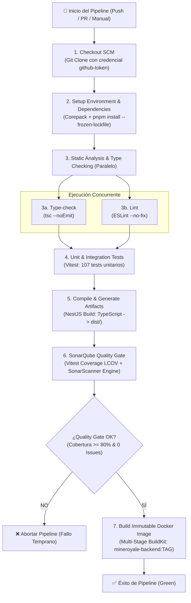
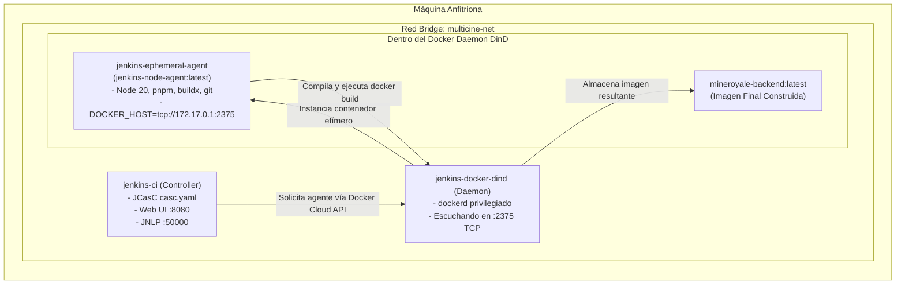

# Arquitectura del Pipeline CI/CD — MineRoyal API

Este documento proporciona una visión técnica detallada de la arquitectura de Integración y Despliegue Continuo (CI/CD) implementada en el proyecto **MineRoyal**, los conceptos de ingeniería DevOps aplicados, y el racional técnico detrás de cada decisión de diseño tomada para asegurar un flujo de entrega continuo robusto, seguro y reproducible.

---

## 1. Filosofía de Diseño y Principios Rectores

El pipeline está diseñado bajo los siguientes principios fundamentales de la ingeniería de software moderna:

1. **Estrategia "Build Once, Deploy Anywhere":**  
   El código fuente se compila, empaqueta y se genera como imagen Docker inmutable una sola vez durante el pipeline. Esa misma imagen generada es la que viaja entre entornos (pruebas, staging, producción), eliminando la discrepancia de dependencias entre fases.
2. **Infraestructura Inmutable y Efímera:**  
   Ningún build se ejecuta directamente en el servidor maestro (Jenkins Controller). Todo el cómputo ocurre en contenedores aislados (agentes efímeros) que nacen al iniciar el build y se autodestruyen al finalizar.
3. **Calidad de Código Como Bloqueante (Quality Gates):**  
   Ninguna compilación defectuosa o con déficit de pruebas puede ser promovida. Si las pruebas fallan o SonarQube no valida el umbral mínimo del 80% de cobertura en código nuevo, el pipeline se aborta de forma inmediata.
4. **Reproducibilidad Absoluta (Configuration as Code - JCasC):**  
   Toda la configuración del servidor de Jenkins, sus agentes y nubes de Docker reside en archivos YAML versionados en Git (`casc.yaml`), evitando configuraciones manuales propensas a errores humanos en la interfaz gráfica.

---

## 2. Diagrama de Flujo del Pipeline

A continuación se ilustra el flujo secuencial y paralelo de ejecución definido en el [`Jenkinsfile`](file:///c:/Users/alejandro/developer/mineRoyal/Jenkinsfile):



---

## 3. Arquitectura de Ejecución: Controller, Docker-in-Docker (DinD) y Agentes

Para lograr aislamiento completo en el pipeline, la arquitectura de ejecución se compone de tres piezas clave orquestadas con Docker Compose:



### 3.1 ¿Por qué Docker-in-Docker (DinD)?
En lugar de montar el socket Docker del host anfitrión (`/var/run/docker.sock`), el uso de un contenedor `docker:27-dind` dedicado proporciona:
- **Aislamiento de seguridad:** Los comandos Docker ejecutados por la integración continua no tienen acceso a los contenedores ni imágenes personales de la máquina del desarrollador.
- **Limpieza de recursos:** Las imágenes intermedias y capas temporales de build quedan encapsuladas en el daemon de DinD.

### 3.2 El reto de la comunicación Docker y la solución TCP
Durante el desarrollo se presentó un desafío crítico: el contenedor del agente efímero intentaba comunicarse con `/var/run/docker.sock`, el cual no existía en su sistema de archivos o generaba errores de permisos (`permission denied`) al ejecutarse bajo el usuario sin privilegios `jenkins` (UID 1000).

* **Solución Técnica Aplicada:**  
  Dado que el contenedor `docker-dind` expone su daemon en el puerto TCP `2375` sin TLS dentro de su red interna, se configuró la variable de entorno:
  ```groovy
  DOCKER_HOST = 'tcp://172.17.0.1:2375'
  ```
  La IP `172.17.0.1` corresponde al gateway de la red bridge interna creada por el daemon de Docker dentro de `docker-dind`. Esto permitió que el cliente Docker del agente (`docker-cli`) se comunicara fluidamente con el motor de Docker sin depender de permisos de sockets UNIX.

---

## 4. Desglose Técnico Etapa por Etapa

### Etapa 1: Checkout SCM
* **Propósito:** Clonar de forma determinista la revisión exacta del commit que disparó el build.
* **Decisión Técnica (GitHub API Rate Limiting):**  
  Las llamadas anónimas a la API de GitHub (`api.github.com`) poseen un límite estricto de **60 peticiones por hora por dirección IP**. Al realizar múltiples escaneos de ramas, el limitador de Jenkins imponía esperas forzadas de varios minutos (`Jenkins-Imposed API Limiter`).  
  **Solución:** Se configuró en el origen del proyecto multirama la credencial `github-token` (Personal Access Token). Al autenticar la conexión con GitHub, la cuota se elevó automáticamente a **5,000 peticiones por hora**, eliminando cualquier pausa o bloqueo en el checkout.

---

### Etapa 2: Setup Environment & Dependencies
* **Propósito:** Proveer el entorno de ejecución exacto e instalar paquetes sin discrepancias.
* **Comando Clave:**
  ```bash
  corepack enable pnpm 2>/dev/null || true
  pnpm install --frozen-lockfile
  ```
* **Decisión Técnica:**  
  - Se utiliza `corepack` para garantizar que la versión de `pnpm` utilizada coincida con la especificada en el campo `packageManager` de `package.json`.
  - La bandera `--frozen-lockfile` es mandataria en CI: si alguien alteró manualmente `package.json` sin actualizar `pnpm-lock.yaml`, la instalación falla intencionalmente para evitar descargar versiones inesperadas de librerías.

---

### Etapa 3: Static Analysis & Type Checking (Paralelo)
* **Propósito:** Detectar errores sintácticos, violaciones de tipos y discrepancias de estilo antes de invertir tiempo en pruebas pesadas.
* **Estructura Declarativa:**
  ```groovy
  parallel {
      stage('3a. Type-check') { sh 'pnpm run type-check' }
      stage('3b. Lint (ESLint)') { sh 'pnpm run lint --no-fix' }
  }
  ```
* **Decisión Técnica:**  
  - El uso de bloques `parallel` aprovecha los núcleos de CPU del agente para ejecutar ambas comprobaciones simultáneamente, reduciendo el tiempo total de ciclo de la pipeline a la mitad en esta fase.
  - Se utiliza `--no-fix` en el linter para que el pipeline no intente modificar código en CI, sino que valide el estado estricto de la entrega.

---

### Etapa 4: Unit & Integration Tests
* **Propósito:** Verificar el comportamiento funcional de los servicios de negocio y la lógica de dominio.
* **Herramienta:** **Vitest** (apoyado en transpilación ultrarrápida con SWC).
* **Decisión Técnica:**  
  Las variables de entorno requeridas por la infraestructura de pruebas se inyectan a través de `withCredentials` y `withEnv` en Jenkins, asegurando que las contraseñas nunca queden expuestas en texto plano en los logs de la consola.

---

### Etapa 5: Compile & Generate Artifacts
* **Propósito:** Compilar el código fuente de TypeScript a JavaScript ejecutable en la carpeta `dist/`.
* **Comando:** `pnpm run build` (`nest build`).
* **Decisión Técnica:**  
  Separar la compilación del código antes del escaneo de calidad permite certificar que la salida transpilada no tiene fallos estructurales antes de enviarla a SonarQube.

---

### Etapa 6: SonarQube / SonarCloud Quality Gate
* **Propósito:** Auditar métricas de mantenibilidad, deuda técnica, olores de código, vulnerabilidades de seguridad y cobertura de pruebas.
* **Umbral Requerido:** Cobertura de código `>= 80%`, duplicación `<= 3%`, 0 vulnerabilidades.

#### El Dilema de la Cobertura: ¿Excluir o Probar?
Durante la auditoría inicial de SonarCloud, el Quality Gate falló debido a que la cobertura en código nuevo era del **53.54%** (requerido $\ge 80\%$), concentrándose la falta de cobertura en `seat.service.ts` (servicio de negocio de selección y bloqueo de butacas).

* **Por qué NO excluir lógica de negocio:**  
  Excluir archivos de lógica empresarial (`*.service.ts`) para forzar un pase verde en SonarQube es un antipatrón grave que enmascara deuda técnica y aumenta el riesgo de introducir bugs silenciosos en producción.
* **Decisión Tomada:**  
  1. Se implementó una suite completa de **16 pruebas unitarias** (`seat.service.spec.ts`) cubriendo todos los métodos de negocio (`lockSeat`, `releaseSeat`, `getSeatsByRoom`, manejo de concurrencia y excepciones).
  2. Se mantuvieron exclusiones legítimas en `sonar-project.properties`:
     - Scripts de inicialización y migraciones: `src/infrastructure/database/migrations/**` y `seeders/**`.
     - Objetos de acceso a datos sin lógica condicional: `src/**/dao/**`.
     - Archivos de arranque del framework: `src/main.ts`, `src/**/*.module.ts`, `datasource.ts`.
  3. **Resultado:** La cobertura ascendió a **93.86%**, superando con honores el umbral y certificando el Quality Gate como **OK**.

---

### Etapa 7: Build Immutable Docker Image
* **Propósito:** Empaquetar la aplicación en una imagen de producción ligera y segura.

```dockerfile
# Arquitectura Multi-Stage de backend/Dockerfile
FROM node:20-alpine AS base         # Capa 1: Node + Corepack + Lockfiles
FROM base AS development            # Capa 2: Dependencias completas para dev
FROM base AS build                  # Capa 3: Compilación con pnpm build
FROM node:20-alpine AS production   # Capa 4: Imagen final ultra-liviana (336 MB)
```

#### Decisiones y Correcciones Técnicas en el Docker Build:
1. **Soporte de BuildKit (`docker-cli-buildx`):**  
   El Dockerfile utiliza montajes de caché avanzados (`RUN --mount=type=cache,id=pnpm,target=/pnpm/store`) para acelerar la instalación de paquetes. Dado que el agente de Alpine no incluía el plugin de Buildx por defecto, se incorporó `docker-cli-buildx` y se exportó `DOCKER_BUILDKIT=1`.
2. **Corrección del Script `prepare` (Husky en Producción):**  
   Al ejecutar `pnpm prune --prod` en la etapa de build, pnpm elimina las herramientas de desarrollo (incluyendo `husky`), y luego dispara automáticamente el script de ciclo de vida `"prepare"`. Como `husky` ya no existía en el contenedor, el build fallaba con `sh: husky: not found`.  
   - **Solución implementada:** Se actualizó `Dockerfile` con la directiva `pnpm prune --prod --ignore-scripts` y se blindó el script en `package.json` con fallback seguro: `"prepare": "cd .. && (husky backend/.husky 2>/dev/null || true)"`.
3. **Etiquetado Inmutable Dual:**  
   La imagen se etiqueta con el hash del commit (`mineroyale-backend:${GIT_COMMIT[0..7]}`) para auditoría y trazabilidad histórica, y adicionalmente con `mineroyale-backend:latest` para despliegues locales directos.

---

## 5. Matriz de Incidencias Técnicas Resueltas

| # | Síntoma / Error | Causa Raíz | Solución Implementada |
|---|---|---|---|
| **1** | `Dial unix /var/run/docker.sock: no such file or directory` | El agente efímero no compartía el socket UNIX del daemon de DinD. | Se configuró `DOCKER_HOST=tcp://172.17.0.1:2375` en el pipeline. |
| **2** | `Permission denied on /var/run/docker.sock` | El usuario `jenkins` (UID 1000) no pertenecía al grupo root/docker del host. | Conexión directa vía socket TCP hacia el daemon interno de DinD sin barrera de permisos UNIX. |
| **3** | `BuildKit is enabled but buildx is missing` | La imagen del agente efímero carecía del binario `docker-buildx` en Alpine. | Se añadió `docker-cli-buildx` al Dockerfile del agente y se recompiló la imagen. |
| **4** | `CoverageFailed: 53.54% < 80.0%` en SonarQube | `seat.service.ts` carecía de suite de pruebas unitarias. | Se escribieron 16 tests unitarios en Vitest elevando la cobertura a **93.86%** en código nuevo. |
| **5** | `sh: husky: not found` al ejecutar `pnpm prune` | El comando `pnpm prune --prod` desinstalaba Husky y disparaba el script `prepare`. | Se agregó `--ignore-scripts` al comando `pnpm prune` y fallback silencioso en `package.json`. |
| **6** | `GitHub API rate limit exceeded (60 req/hr)` | El escaneo de ramas en Jenkins consultaba la API pública de GitHub de forma anónima. | Se vinculó la credencial `github-token` en la definición del SCM multirama. |
